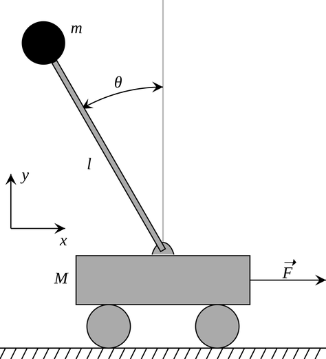
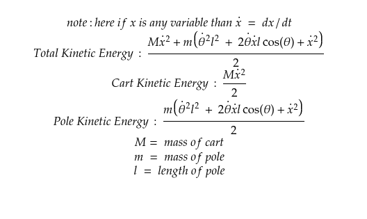
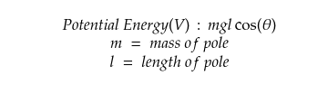
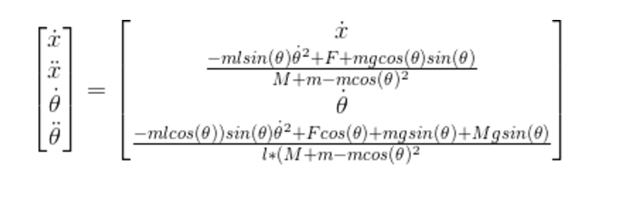
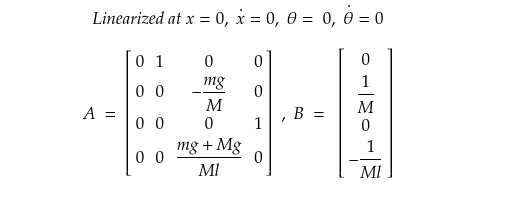

Here we will explore a famous control problem - the cart-pole control in an interactive way. Try to solve every tasks below first by yourself than refer to the answer provided. To view answer just click on the dropdown like:

  
Click to expand!

    yeah just like that

# CART-POLE CONTROL

This is a classic control problem because deriving the dynamics is relatively straightforward, but it still belies some inherent complexity due to its underactuated nature. By underactuated nature it means there are fewer actuated degrees of freedom than there are degrees of freedom of the system. In this case, there is only 1 actuated DOF, but 2 system DOF. The concepts explored here can be extended to control any dynamic system, though not all systems are so straightforward to implement.

    
    

    <i>Cart-Pole System:</i>  

The dynamics of the cart pole system is determined by evaluating the system using Lagrangian Mechanics, which most of you must have studied in PHY 101 in 1st year. Although if you are knew to it you can refer this video [here](https://www.youtube.com/watch?v=8UtnDaGHpq0) to get basic understanding.

The Lagrangian of the cart pole system uses the general energy equation L = T – V where L is the Lagrangian term generalizing the total energy in the system, T is the kinetic energy of the system, and V is the potential energy of the system. 

* ### Calculation of Lagrangian Term
    

        
Kinetic Energy

        The kinetic energy(T) of the system is represented by:  
        

            
            

            <i>Kinetic Energy</i>  
        

    

    

        
Potential Energy

        The potential energy(V) of the system is represented by the potential energy of the pole. Pole Potential Energy: 
        

            
            

            <i>Potential Energy</i>  
        

    

    L = T - V
The nonlinear dynamics are then found by finding the Euler-Lagrange Equations using: 
    

        
        

    

    where q can represent two generalized coordinate variables of x and 𝜃(theta).

By solving the Euler-Lagrange Equations using the Lagrange(L) that we calulated earlier The nonlinear dynamics of the system can then be represented as:
    

        
        

    

    where _x_ is the cart position, _x_dot_ is the velocity, _θ_ is the pendulum angle, _θ_dot_ is the angular velocity, _m_ is the pendulum mass, _M_ is the cart mass, _l_ is the pendulum arm length, _g_ is the gravitational acceleration and _F_ is a control force applied to the cart.

These dynamics need to be linearized in order to implement a linear controller.

        
Linearization

        Linearization is achieved by computing the Jacobian and then inserting the resulting equations into state space form:
        

            
            

        

    

