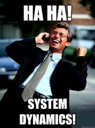
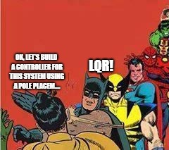

# Let's Dive Deeper

Now that you have known abou a system and it's dynamics. It is time to control those dynamics and bring stability to the unstable system.

 

 <i></i> 

You have seen the equation of a system with A dynamics matrix, B actuation matrix and control u.

 

 <i></i> 

When we change this u to feedback control i.e., the current control input u depends on the current state x of the system ( **u = -kx** ). Then we get the equation as - 

 

 <i></i> 

## Controlling the system

Now, A and B are fixed. If you want your system to be stable, you want to have stable eigen values. Here, K is a variable that we can choose for ourselves. Hence, this **K acts as the control knob**. 

We adjust our k to place the eigen values of our system wherever we want. Hence, by controlling the placement of eigen values, we can control the dynamics of our system. And by making eigen values negative, we can make sure that our system converges to origin.

This can be done with a simple command in MATLAB. Though we wont be using it here. we just give the matrices A, B and the eigenvalues we want our system to have and it returns the matrix k.

**K = place(A, B, eigs)**

This is called **Pole Placement.**

The calculations include some mathematics from linear algebra but the computational tools help us to calculate such matrices pretty fast.

 

 <i>No need for advanced mathematics here!!</i> 

Once your system becomes stable, you can shift your origin anywhere you want and the system will converge to that point in some time. If the initial state of the system is that point then the control will make sure that the system maintains that state. The shift of origin is carried out like this - 

 

 <i>No need for advanced mathematics here!!</i> 

## The Big Question

**Now if we can put the eigen values where ever we want, what is the best place to put them to?**

 

 <i></i> 

Well, the following things depend on the position of eigen values:

* How fast the system converges to the required state.
* How much power the actuators use to get to the required state.
* How smoothly the system converges.

So, In control theory optimization algorithms are used to find optimal eigen values for a system and control it in the most efficient way. One of these control algorithms is LQR which is very popular.

# LQR control

 

 <i>LQR is just optimal pole placement.</i> 

Well, in LQR we introduce two matrices. Q and R.

These are cost matrices which are the parameters that we tune. These act as control knob for controlling the system.

1. The Q matrice is a diagonal matrix of nxn which contains the cost of each variable of the state. The higher the cost, the quickly the system needs to converge to that particular variable.

2. The R matric is a 1xz matrix where z is the number of actuators in the system. It decides how much cost is associated with each actuator. The higher the cost of an actuator, the lest power it must use.

For example, for the pendulum example that we saw earler - 

 

 <i></i> 

The Q and R matrices would look something like - 

 

 <i>Q matrix</i> 

 

 <i>R matrix</i> 

Now, we introduce a cost function that calculates the cost associated with the converges of the system and tries to minimise it. This cost is given as - 

 

 <i>LQR cost</i> 

Here, X and u are the state and actuator matrices at any time tau and the J is it's integration over a long time (equivalent to infinite amount of time).
What LQR does is it tries to produce a K matrix such that this J cost is minimum. This is an optimization problem and it's mathematics can't be covered here but modern control libraries in python and MATLAB can give you the K matrix with a single command, given you know values of A, B, Q and R.

**K = lqr(A, B, Q, R)**

Once we place the value of K into the dynamics, we get an optimal converging system which we can control and converge to any point that we like.

Well, that's all from our side for this week. Don't forget to attempt challenge of the week. See you soon. Happy learning.

 

 <i></i> 

## Further Readings - Extras

1. Here is a great playlist on basics of control that covers all that has taken place in this camp yet in great detail. Watch this if you are really interested in controls and want to become a controls expert -

