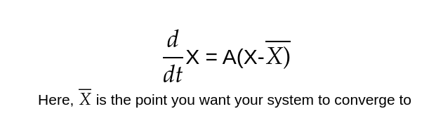

# So you are here, Let's carry on then

 

 <i></i> 

# Stability of a System

 

 <i>It's Big Brain time.</i> 

So we hope until now you would have some idea about eigen values and eigen vectors. They are the very essence of linear algebra. If you want to broaden your understanding of linear algebra, we have provided an amazing playlist from 3Blue1Brown in the extras. For now, let's move on to the stability of a system.

 

 <i>If you know it, you know it!!</i> 

if you denote a linear system as

 

 <i>The equation defines how system is changing with repect to the current state of the system.</i> 

**A system is said to be stable if it's state converges to 0 if it is left undisturbed for some time. It is said to be unstable if the state diverges infinity.**

We can quickly check if a system is stable or not by looking at it's dynamics matrix A. 

**IMPORTANT - If all the eigen values of matrix A have a negative real part then the system is considered to be stable. If even one of the eigen values have a positive real part then the dynamics of the system are unstable and it'll diverge.**

So that is a quick way to check if the system is stable or not. Now if the dynamics of your system are stable, You can steer it to any state that you want. We know if a system is stable, it'll converge to origin after some time. So in order to converge it to a particular point, we shift our origin to that state by modifying the equation as - 

 

 <i>The system is linear should hold at every point around X(bar) in the system.</i> 

For now, this is all about stability that you need to know. For solving problems, you can always use numpy in python to find eigen values and eigen vectors of any matrix.

# Controllability

 

 <i>Finally, we talk about control.</i> 

What to do if the dynamics of a system are unstable? Here, The controls come in like - 

 

 <i>Let's gain back the control.</i> 

So, using control, we introduce some actuators in the dynamics of the system. These actuators can be motors, linear actuators, temoerature controllers etc. Our goal is to introduce the actuators in such a way that it changes the stability of the system.
So, if the passive equation for your system is - 

 

 <i>The equation defines how system is changing with repect to the current state of the system.</i> 

Then, after introducing some actuators, the equation becomes - 

 

 <i>Bu is introduced as some external interfernece to the system.</i> 

* B depends on the placement and nature of actuator in your system. If you are designing your system yourself, then you might be able to change B. But if we are working to control pre-designed systems, then B is fixed.
* u is the amount of power your actuators apply. In a feedback control, we usually set it to u = -kx. where, x is the current state of the system. So, our actuation depends on the current state of the system.

So, B should be such that it changes the dynamics of the system and make it intrinsically stable.
So, after we get a B matrix, first thing is to check if the system with given dynamics matrices A and B is stable and hence controllable or not. So, we introduce the concept of controllability.

**Basically, by introducing Bu we try to change the eigen values of A that had a positive real part to eigen values with negative real part, making the system stable and hence controllable.**

A natural question arises in linear control theory: 
To what extent can closed loop feedback **u = −Kx** manipulate the behavior of the system.
Consider the unstable inverted pendulum equations with an actuator at the hinge, the linearized equations are:

 

 <i></i> 

We can see that it is possible to modify the eigenvalues of the unstable inverted pendulum system via closed-loop feedback, resulting in a new system matrix (A−BK) with stable eigenvalues. This section will provide concrete conditions on when and how the system dynamics may be manipulated through feedback control. So, if we put **u=-kx** then the differential equation for the system becomes 

 

 <i></i> 

Now, A-BK are the upadted dynamics of the system and they should be such that the system is stable.

## Theory
We can put the eigen values of A-BK anywhere we want by deciding a good K but this is only possible if the matrices A and B together form a controllable system. Hence, to check if A and B form a controllable system or not, we check the controllability matrix.The  controllability of a linear system is determined entirely by the column space of the controllability matrix C:

 

 <i></i> 

If the matrix C has n linearly independent columns, so that it spans all of **R^n^**, then the system is controllable, that is to say of the rank of the matrix C is equal to n, then the system is controllable. 

**Note - Here nxn is the dimension of matrix A**

We hope that you have some idea about what the rank of a matrix means. Even if you don't, there is no need to worry. The rank can be obtained easily using numpy in python or matlab. Here, is a quick video explaining the rank of a matrix - 

The following three conditions are equivalent if rank(C)=n:
1. System is *controllable*
2. *Arbitrary eigenvalue placement*. It is possible to design the eigenvalues of the closed-loop system through choice of feedback 
    u = −Kx. i.e for desired eigenvalues we can determine a value of K.

 

 <i></i> 

3. *Reachability* of R^n^ . It is possible to steer the system to any arbitrary state x(t) = ξ ∈ R^n^ in a finite time with some actuation signal u(t).
    
## Intuition
The span of the columns in matrix C determine all the state vector directions in R^n^ which can be controlled. So rank(C)=n implies that all state vector directions in R^n^ are controllable. Thus, in addition to controllability implying arbitrary eigenvalue placement, it also implies that anystate ξ ∈ R^n^ is reachable in a finite time with some actuation signal u(t).

Read it again, and if it doesn't makes sense to you, contact any of your mentors. They are waiting to serve you.

 

 <i>We are always here for you!!</i> 

## Example
The notion of controllability is more easily understood by investigating a few simple examples. First, consider the following system:

 

 <i>The rank of the controllability matrix C is not equal 2 here (n=2).</i> 

This system is not controllable, because the controllability matrix C consists of two linearly dependent vectors and does not span R^2^. Even before checkingthe rank of the controllability matrix, it is easy to see that the system won’t be controllable since the states x1 and x2 are completely decoupled and the actuation input u only effects the second state.
Modifying this example to include two actuation inputs makes the system controllable by increasing the control authority

 

 <i>Here the rank of controllability matrix is 2 (n=2).</i> 

This fully actuated system is clearly controllable because x1 and x2 may be independently controlled with u1 and u2. The controllability of this system is confirmed by checking that the columns of C do span R^2^.

## Game Time

 

 <i>Are You Ready?????!!!!!!</i> 

1. For the given system of inverted pendulum which has been linearised about a fixed state, find the control matrix C. Here d is for frictional damping.

 

 <i></i> 

2. Intuitevely, what is the importance of the K matrix in the given system?

 

 <i></i> 

Now you are ready for Did You Get Control? - Part 4
Here is the link - 
[Did You Get The Control? - Part 4](https://forms.gle/VTWDbMSut3sC3e5i8)

## Further Readings - Extras
1. [The PBH test for controllability](https://youtu.be/0XJHgLrcPeA)
2. [The Cayley–Hamilton theorem,](https://youtu.be/PrfxmkBsYKE) [Cayley-Hamilton Theorem for controllability and reachability](https://youtu.be/gpIhGAUoeNY)
3. [Degrees of controllability and Gramians](https://youtu.be/ZNHx62HbKNA)
4. [Essence of Linear Algebra - 3b1b](https://youtube.com/playlist?list=PLZHQObOWTQDPD3MizzM2xVFitgF8hE_ab)
