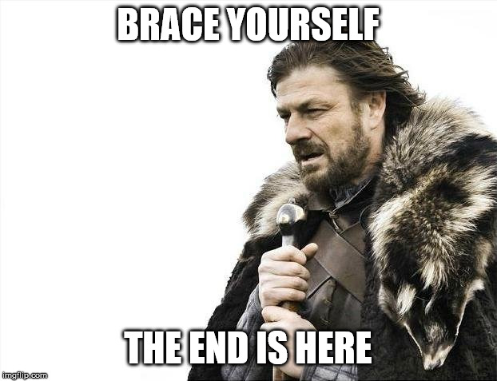
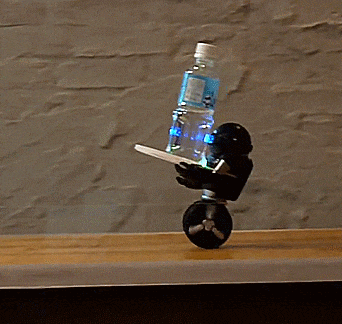
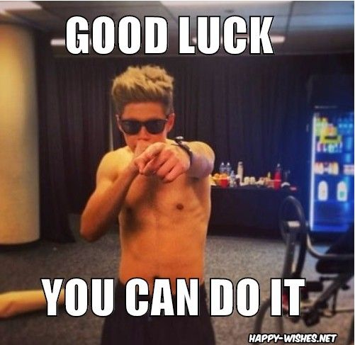

# The Final Challenge

Welcome to the final challenge of the CnD camp 2021.

 

So far you have learnt the following things - 

* Basics of PyBullet Simulator
* PID controller
* LQR controller

As a final project, we want you to use everything you have learnt so far and develop a self balancing bot which can be controlled using arrow keys and traverse in 3D space.

## The problem statement -

 

You have to use all the resources you have been provided yet (The sample codes, URDFs and most importantly knowledge) to design a self balancing bot in PyBullet Simulator which can do the following - 

1. Move forward on pressing the key *'w'*
2. Move backwards on pressing the key *'s'*
3. Rotate towards left about its axis on pressing the key *'a'*
4. Rotate towrads right about its axis on pressing the key *'d'*

You can use any techniques learnt so far to design the robot.
You can brainstorm and find the ideal combination of controllers to do the trick. 

**You are free to add any extra features to the bot. Extra points will be given for any novel feature implemented apart from the ones mentioned above**

We want you to gather the resources and code from scratch based on your experience. So, we are not providing any sample code files or resources along with this task. Mentors will be here to guide you through every step in case you feel stuck at any point. 

*We want you to develop your problem solving abilities, learn to identify problems and think of solutions from the scratch. We believe that you can do that.*

At last we would like to say - 

 

Compress the folder with the code and URDF files and upload your solutions in *.zip format at this link - 

[The Final Challenge](https://forms.gle/nutUEqNJYphpxm5QA)

