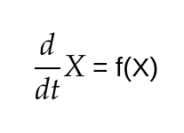
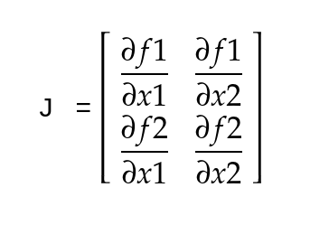

# Welcome Back

 
 

 <i>It's learning time!!</i>  

Let's dig a little deeper into the controls and dynamics together this week. We begin our journey with the world of **Linear Systems.**

## Linear Systems
A system (say a robot or anything that you want to control) whose dynamics can be represented as a differential equation of the form 

 

 <i>The equation defines how system is changing with repect to the current state of the system.</i>  

is called a **Linear System.**

Here, A is a square matrix (of dimension nxn) that represents the dynamics of the system and X is a vector of dimension (nx1) which represents the state of a system.

The state consists of the variables that are used to define the current state of affairs of the system. 

For example, In a robot the state may include it's velocity and position. Then the matrix A will form the dynamics of the robot defining the relation between the derivatives of the position and velocity to actual position and velocity.

## Forming the Linear Equation

The simplest example of a linear system is a spring mass system like this - 

 

 <i>Simple spring mass system</i>  

You can easily solve it using newton's laws of motion but we prefer to solve this through langrange equations as these equations come in handy with complicated systems. We hope you didn't miss your physics classes, but even if you did, lagrange equations are pretty simple. Here is a video link to brief you upto that. This also contains the solution to the given problem.

 

 <i>Here comes the physics!!</i>  

Now, from the video you can infer that we can write the dynamics equation for the given system in the form of

 
 

Now, we can write this equation in term of matrices and vectors. The equation can be written as - 

 

 <i>Linear Equation for spring mass system</i>  

Here, x and x(dot) are the variables that define the state of the system at ay given time step.

## Linearizing a non-linear system

Well, most systems are pretty complex and it is not possible to represent them in a linear form. So, usually we have tricks to approximate a non-linear system to a linear system about a particular point. 

**Non-linear systems** have a non-linear relation between the current state and the change of state. The differential equation representing a non-linear equation can be written as - 

 

 <i>Here, f(x) is a non linear function.</i>  

Non-linear systems are hard to control and hence it helps if we can approximate them as linear systems and develop control schemes for them.

There are only some fixed states in the system about which you can linearize your non-linear system. These states are called fixed states and these can be found by the equation

 

 <i></i>  

In case you are bored, just remember in the end all this physics/maths will be worth it.

 

 <i>Keep Going!!</i>  

Now, to linearize about the fixed state, first we need to find the jacobian matrix of f(x). Now, jacobian is a first order differential matrix which is a very important tool in robotics. We currently cannot go in depth of what jacobian is, but this is how you calculate it for a given differential equation - 

So the above equation, when written in a matrix form, assuming there are two state variables x1 and x2 would be represented as - 

 

 <i></i>  

The jacobian for this will be given as - 

 

 <i></i>  

Then, finally to linearise a system about a fixed point, we put in the **fixed state** variables in the jacobian to get A matrix

 

 <i></i>  

Now, we can write our non-linear system as an approximated linear system about the state x(bar) represented by the equation - 

 

 <i></i>  

Hence, we have successfully linearized a non-linear system about a fixed state. 

**Note- This linearization is valid only when the state of the system remains close to the fixed state. If the system diverges away from the fixed point, approximation will become invalid and the system will collapse.**

Mastering Eigen Values and Eigen Vectors -

To proceed further we need some idea about eigen values and eigen vectors. So read this article about eigen values and eigen vectors - 

[Eigen values and Eigen vectors](https://www.mathsisfun.com/algebra/eigenvalue.html)

 

 <i>Congratulations on completing SubPart - 1</i>  

# Game Time

 

 <i>Guess who's back? back again.</i>  

  

Now, we'll apply all that we have learnt on a simple inverted pendulum. It's time for Did You Get Control?

[Did You Get Control? - Part 3](https://forms.gle/1kCRmMr2SBnp4Pkw7)

